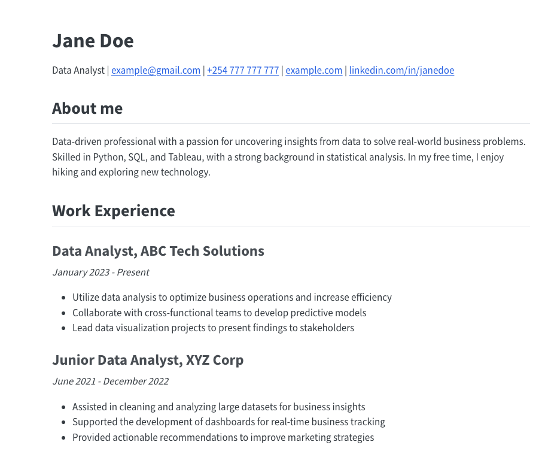

# Quarto Resume Template

Create a professional resume website and PDF for free using GitHub Pages and Quarto!

## 🌟 Features

- **Dual Format**: Get both an HTML website and a PDF version of your resume
- **Easy Updates**: Simple text-based resume storage with automatic regeneration
- **Free Hosting**: Utilize GitHub Pages for cost-free web hosting
- **Professional Domain**: Your site at `<your-github-username>.github.io`
- **Version Control**: Track changes and revert if needed
- **Full Content Control**: Unlike third-party platforms, you own your data
- **Trusted Platform**: Leverage GitHub's credibility in the tech industry

## 🚀 Quick Start

1. **Use this template** or fork the repository
2. Name your repository `<your-github-username>.github.io`
3. Edit `RESUME.md` with your information
4. Customize `RESUME.json` and `_quarto.yml` (optional)
5. Enable GitHub Pages in your repository settings

Your resume will be live at `https://<your-github-username>.github.io`!

For detailed instructions, check out our [step-by-step guide](https://toknow.ai/posts/quarto-resume-template/).

## 📘 Resources

- [Sample Resume Website](https://toknow.ai/quarto-resume-template/)
- [Sample Resume PDF](https://toknow.ai/quarto-resume-template/index.pdf)
- [Detailed Blog Post](https://toknow.ai/posts/quarto-resume-template/)

## 🛠 Customization

- Edit `RESUME.md` to update your resume content
- Modify `RESUME.json` to change site metadata
- Adjust `_quarto.yml` to alter the site's theme or layout

## 🤝 Contributing

Contributions are welcome! Please feel free to submit a Pull Request.

## 📄 License

This project is open source and available under the [GNU General Public License v3.0 (GPLv3).](LICENSE).

## 💬 Support

If you encounter any issues or have questions, please [open an issue](https://github.com/ToKnow-ai/quarto-resume-template/issues) in this repository.

---

Happy job hunting, and enjoy your new resume website! 🎉